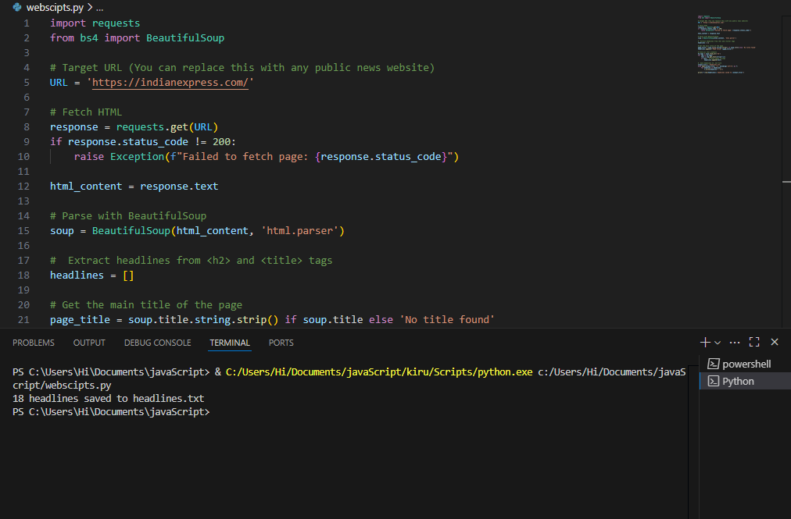
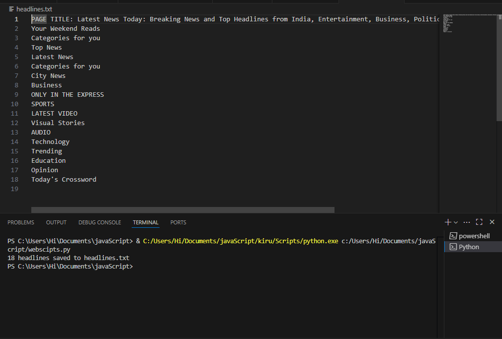

 Task3-Web_Scraper
 -----------------

Indian Express Headline Scraper
--------------------------------------

This Python script scrapes headlines from the [Indian Express](https://indianexpress.com/) homepage and saves them to a text file.

Features
----------
- Fetches the HTML content of the Indian Express homepage.
- Parses the page using BeautifulSoup.
- Extracts the main page title and all headlines within `<h2>` tags.
- Saves the results to a local text file (`headlines.txt`).
 Requirements
-------------
- Python 3.x
- Required libraries:
  - `requests`
  - `beautifulsoup4`

You can install the dependencies using pip:

```bash
pip install requests beautifulsoup4
Usage
Clone or download the script.

Run the Python file:
--------------------
bash
Copy
Edit
python script_name.py
Replace script_name.py with the actual name of the Python file.

After execution, a file named headlines.txt will be created in the same directory, containing the extracted headlines.

Output
The headlines.txt file will contain:

The page title of Indian Express.

All headlines extracted from <h2> tags on the homepage.

Example:
-----------

python-repl
Copy
Edit
PAGE TITLE: Latest News, India News | The Indian Express
Top news today
India vs Australia: Match Highlights
...

 📷 Screenshot

.

.


Notes
------
This script only fetches content from the homepage and may not extract all headline types (e.g. headlines in <h3> or other tags).

Ensure that scraping is done responsibly and in accordance with the website’s terms of service.

License
----------
This project is open-source and free to use for educational and personal projects.
